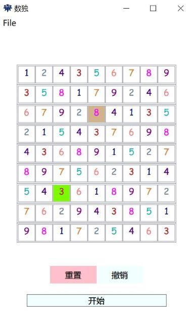

## Some Trivial Tools
### sudoku-solver
A solver for 9x9 sudoku puzzles based on WPF



### tank-clash
A small tank game based on sfml


### sudoku-solver
A solver for 9x9 sudoku puzzles based on [React](https://github.com/facebook/React)

Usage:
1. Install nodejs
2. Create a react app and replace the files in the `src` folder

   ```sh
   npx create-react-app app
   cd app
   npm start
   ```

3. Visit the assigned port of localhost

